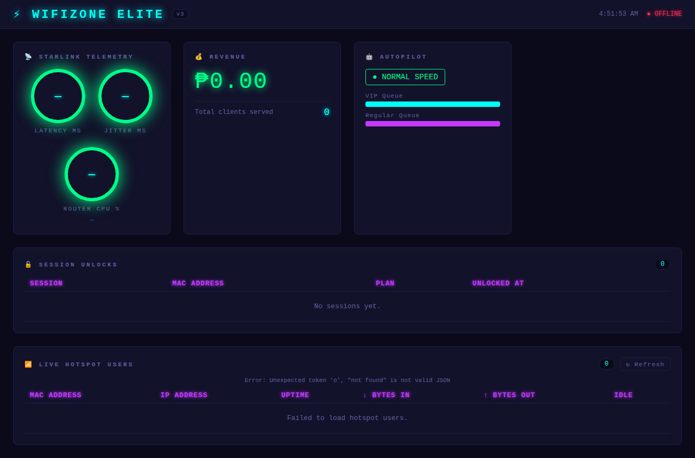
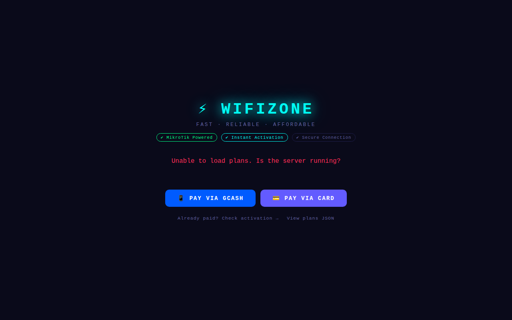
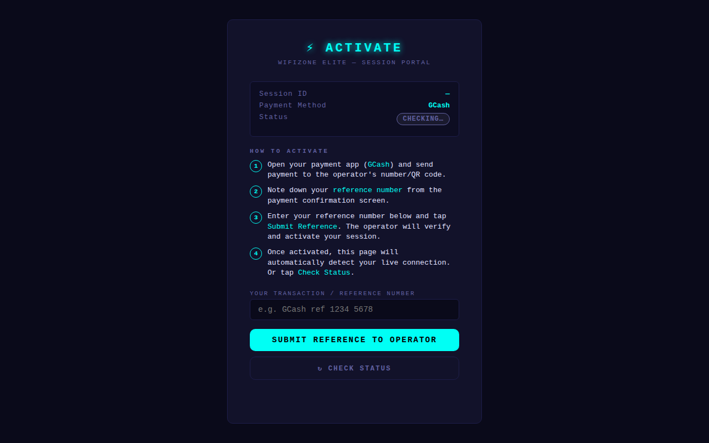

# ⚡ WIFIZONE ELITE

**ISP-grade WiFi hotspot management system powered by MikroTik + Starlink.**

WIFIZONE ELITE turns a MikroTik router into a full captive portal with time-based billing, GCash / Stripe payment integration, real-time telemetry, and an operator cockpit dashboard.

---

## Architecture

```
[ Starlink ]
     │
[ MikroTik Router ] ←──── WiFi Zone OS Backend (this repo)
     │                         • Payment processing
     │                         • Hotspot user management (API port 8728)
     │                         • SNMP telemetry + auto-balance
     │
[ User WiFi Clients ]
     │
[ Captive Portal → frontend/index.html ]
     │
[ Payment (GCash / Stripe) ]
     │
[ Session activated on MikroTik via API ]
```

---

## Screenshots

### Operator Cockpit (Admin Dashboard)

The operator dashboard shows live Starlink telemetry gauges, total revenue, autopilot queue status, the last 50 session unlocks (via WebSocket), and a live MikroTik hotspot users table that auto-refreshes every 30 s.



### User Landing Page (Captive Portal)

The client-facing portal lists available plans and lets users choose GCash or Card payment.



### Session Activation Page

After selecting a plan, users are redirected here. They enter their payment reference number for operator verification, and the page polls the backend every time they click "Check Status" to detect when the operator has activated their session.



---

## Features

| Feature | Status |
|---|---|
| Real MikroTik captive portal | ✅ |
| Time-based session billing | ✅ |
| GCash webhook callback | ✅ |
| Stripe webhook + signature verification | ✅ |
| Per-user speed control (`queue simple`) | ✅ |
| VIP / Regular profiles | ✅ |
| Starlink SNMP telemetry | ✅ |
| Autopilot queue throttling | ✅ |
| Real-time WebSocket dashboard | ✅ |
| Live hotspot user sync | ✅ |
| Duplicate txn_id protection | ✅ |
| Rate limiting on all endpoints | ✅ |

---

## Prerequisites

- **Node.js** 18+
- **MySQL** 8+
- **Python** 3.10+ (for bootstrap scripts)
- **MikroTik** router (hAP lite, RB750Gr3, or any RouterOS 6/7 device)
- MikroTik API service enabled on port **8728**

---

## Quick Start

### 1. Clone & Install

```bash
git clone https://github.com/SolanaRemix/wifizone.git
cd wifizone/backend
npm install
```

### 2. Database

```bash
mysql -u root -p < db/schema.sql
```

### 3. Configure

Copy the example configs and fill in your details:

```bash
cp config/router.json    config/router.local.json
cp config/payment.json   config/payment.local.json
```

Edit `config/router.local.json`:

```json
{
  "host": "192.168.88.1",
  "port": 8728,
  "user": "admin",
  "password": "YOUR_ROUTER_PASSWORD"
}
```

Edit `config/payment.local.json` or set environment variables:

| Variable | Description |
|---|---|
| `STRIPE_SECRET_KEY` | Stripe secret key (`sk_live_...`) |
| `STRIPE_WEBHOOK_SEC` | Stripe webhook signing secret (`whsec_...`) |
| `DB_HOST` | MySQL host (default: 127.0.0.1) |
| `DB_USER` | MySQL user (default: root) |
| `DB_PASSWORD` | MySQL password |
| `DB_NAME` | MySQL database (default: wifizone_elite) |
| `PORT` | HTTP port (default: 3000) |

> **Security:** Never commit real credentials. `config/router.local.json` and `config/payment.local.json` are in `.gitignore`.

### 4. MikroTik Router Setup

Apply the included RouterOS script:

```
# 1. Upload to router via WinBox File Manager or SCP/SFTP:
sftp admin@192.168.88.1
put router-config.rsc router-config.rsc

# 2. In WinBox terminal or SSH:
/import router-config.rsc
```

The script configures:
- DHCP client on `ether1` (WAN/Starlink)
- Bridge (`ether2` + `wlan1`) for LAN clients
- DHCP server `192.168.88.10–254`
- MikroTik Hotspot with `VIP` and `REGULAR` profiles
- Firewall mangle rules for packet marks (`vip` / `regular`)
- Queue tree for global bandwidth shaping
- NAT masquerade
- API service on port 8728
- SNMP for telemetry polling

### 5. Start the Backend

```bash
cd backend
node server.js
```

Or using the Windows bootstrap:

```powershell
# Full start (with deployer checks)
.\scripts\bootstrap.ps1

# Extended start (autopilot + dish controls, deployer in separate window)
.\scripts\bootstrap.ps2
```

The server starts on `http://0.0.0.0:3000`.

---

## Pages

| URL | Description |
|---|---|
| `http://YOUR_SERVER:3000/` | Operator dashboard (admin-panel) |
| `http://YOUR_SERVER:3000/index.html` | Client captive portal landing page |
| `http://YOUR_SERVER:3000/login.html` | Session activation page |

---

## API Reference

### `GET /api/plans`
Returns available plans ordered by duration.

```json
[{ "id": 1, "name": "1 Hour", "duration_minutes": 60, "price_pesos": "10.00" }]
```

### `POST /api/session/start`
Creates an unpaid session for a client device.

```json
{ "mac_address": "AA:BB:CC:DD:EE:FF", "plan_id": 1 }
```

Returns `{ session_id, user_id }`. Session auto-expires if unpaid within 5 minutes.

### `POST /api/payment/gcash/callback`
Called by GCash payment webhook to confirm a payment.

```json
{ "session_id": 1, "txn_id": "REF123", "amount": 10.00 }
```

### `POST /api/payment/stripe/webhook`
Called by Stripe with a verified `payment_intent.succeeded` event.  
Requires a valid `Stripe-Signature` header — **not callable from a browser**.

### `GET /api/session/:id/status`
Returns the current status of a session (for client-side polling).

```json
{ "id": 1, "status": "active", "plan": "1 Hour", "start_time": "...", "end_time": "..." }
```

### `GET /api/hotspot/users`
Returns live active sessions pulled from MikroTik's hotspot.

```json
[{ "mac": "AA:BB:CC:DD:EE:FF", "ip": "192.168.88.10", "uptime": "1h30m", "bytesIn": 1048576, "bytesOut": 524288, "idleTime": "0s" }]
```

### `GET /api/telemetry`
Returns latest SNMP telemetry snapshot.

```json
{ "latencyMs": 45, "jitterMs": 3, "cpuLoad": 12, "timestamp": "2026-04-15T04:27:09.389Z" }
```

### `GET /api/stats`
Returns operator statistics.

```json
{ "total_clients": 42, "total_revenue": "2100.00" }
```

---

## Session State Machine

```
unpaid ──(payment confirmed)──▶ active ──(end_time reached)──▶ expired
  │
  └─(timeout, no payment)──────────────────────────────────────▶ expired
```

Duplicate transaction IDs are rejected. Sessions are locked in MikroTik via `addUser()` and auto-disconnected by the router timer.

---

## Security Notes

- **Stripe webhooks** are verified using `stripe.webhooks.constructEvent()` with a signing secret.  
  The raw request body is preserved for signature verification (raw parser registered before JSON parser).
- **GCash callback** should be secured with HMAC or IP allowlist in production (see `backend/server.js` comments).
- **Credentials** (router password, Stripe keys) should be in environment variables — not committed.
- All payment and API endpoints are rate-limited.

---

## Directory Structure

```
wifizone/
├── admin-panel/          Operator cockpit (HTML/CSS/JS)
│   ├── dashboard.html
│   ├── dashboard.js
│   └── neon.css
├── backend/              Node.js backend
│   ├── server.js         Express API + WebSocket hub
│   ├── mikrotik.js       MikroTik API bridge (mikronode)
│   ├── router-control.js Queue/tree management (mikronode-ng)
│   ├── starlink.js       SNMP telemetry poller
│   ├── autopilot.js      Auto bandwidth balancer
│   └── package.json
├── config/               Configuration files (commit only templates)
│   ├── router.json
│   └── payment.json
├── db/
│   └── schema.sql        MySQL schema + idempotent seed data
├── frontend/             Client captive portal pages
│   ├── index.html        Plan picker / landing page
│   └── login.html        Session activation / status page
├── scripts/
│   ├── bootstrap.ps1     Windows quick-start
│   ├── bootstrap.ps2     Extended start (autopilot + dish)
│   └── deployer.py       Python environment checker + server launcher
└── router-config.rsc     MikroTik RouterOS import script
```

---

## License

[MIT](LICENSE)
